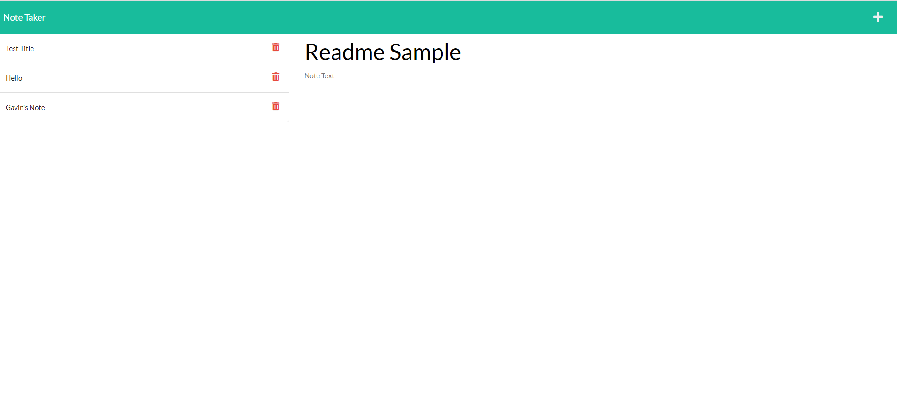

# Note-Taker

​
- [General info](#General-Info)
- [Technologies](#Technologies)
- [Deployment](#Deployment)
- [Summary](#Summary)
​
​
## General-Info
​
General description here
​
This project is a note taking app made using a db.json file to store not objects. 
​
Deployed link: 
​https://protected-woodland-00652.herokuapp.com/

Landing page 
​
​

## Technologies
​
Project is created with:
​
- [Node.js](https://nodejs.org/)
- [Express.js](https://expressjs.com/)
​
## Deployment
​
This app is deployed on Heroku using a free version so please reload if the application has not been visited recently.
​
## Code Overview
​
- This application uses a routes file to direct user input into a database json that can be accessed later. 
​
​
## Authors
​
- Gavin Murphy

## License
​
- Open Source